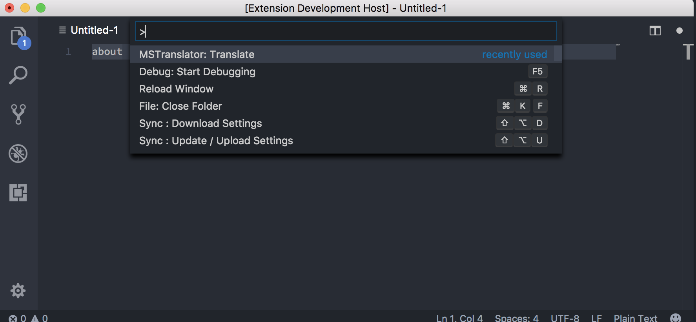
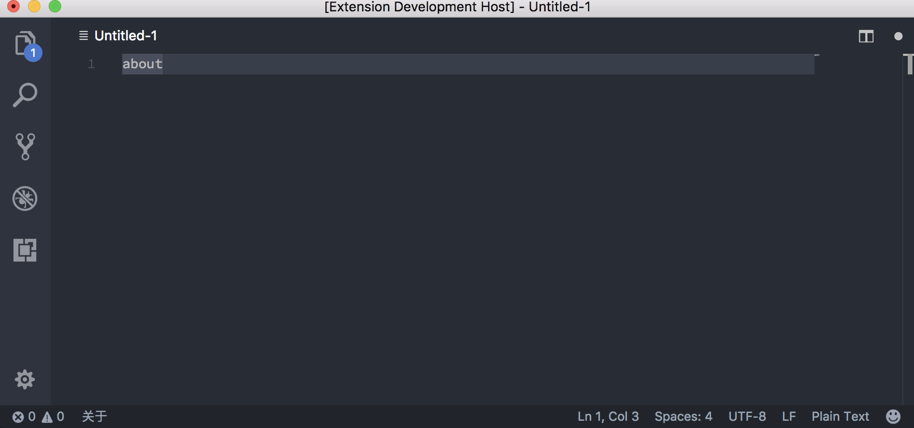

# VSCode - MSTranslator README

This is a simple English-Chinese translator extension using Microsoft Translator for VS Code.

* Translate selected words
* Translate current cursor word

## Functionality

* `> MSTranslator: Translate`

* Lookup translation result in status bar

## Release Notes

### 0.0.1

Initial release.
